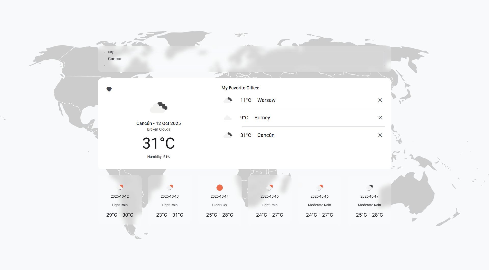

# 🌦️ Weather Angular App

**Weather Angular App** is a modern, mobile-friendly web application built with Angular 20. It allows users to view the current weather and a 5-day forecast for any selected city. The app integrates with the OpenWeatherMap API and GeoDB Cities API to provide accurate weather data and city search functionality. Users can also save their favorite cities and benefit from local caching to reduce unnecessary API calls.



## 🚀 Features

- 🌍 Search for any city worldwide
- ☀️ View current weather conditions
- 📅 5-day weather forecast
- ⭐ Add cities to favorites
- ⚡ Local caching with `localStorage` (valid for 1 hour)
- 📱 Fully responsive design for mobile and desktop

## 🛠️ Technology Stack

| Technology             | Purpose                                    |
|------------------------|--------------------------------------------|
| **Angular 20+**        | Frontend framework                         |
| **Angular Material**   | UI components following Material Design    |
| **TailwindCSS**        | Utility-first CSS framework for styling    |
| **OpenWeatherMap API** | Weather data and forecasts                 |
| **GeoDB Cities API**   | City search and autocomplete functionality |
| **LocalStorage**       | Caching weather data for performance       |

## 📦 Installation

```bash
git clone https://github.com/jaroslawwroblewski/weather-angular-app.git
cd weather-angular-app
npm install
ng serve
